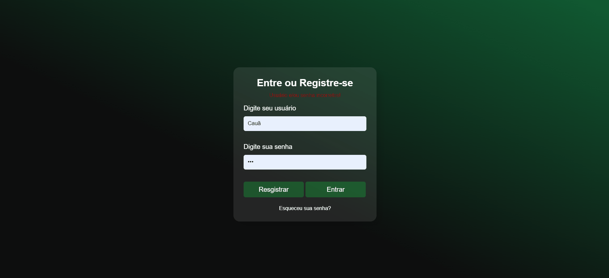

# BataMeta - Alcance suas Metas Financeiras

Bem-vindo ao BataMeta, sua ferramenta pessoal para conquistar suas metas financeiras! Este projeto, originalmente desenvolvido como monolito, está em constante evolução. Pretendemos transformá-lo em uma API RESTful e transferir o banco de dados para MongoDB, visando uma arquitetura mais escalável e flexível. Utilizando tecnologias como Node.js, Express, Sequelize, MySQL e EJS, o BataMeta continuará a oferecer uma solução completa e intuitiva para gerenciar suas finanças e alcançar seus objetivos.

## Funcionalidades Atuais

- **Definição de Metas:** Configure suas metas de economia, inserindo o valor total que deseja alcançar.
- **Acompanhamento de Progresso:** Visualize facilmente o quanto você já economizou em comparação com o valor total da meta, mantendo-se atualizado sobre seu progresso.
- **Dashboard Interativa:** Acesse uma dashboard intuitiva que exibe gráficos e informações detalhadas sobre suas metas e evolução financeira.

## Futuras Atualizações

- **Transformação em API RESTful:** Refatore o projeto para uma arquitetura de API RESTful, possibilitando uma melhor separação de preocupações e facilitando a integração com outras aplicações.
- **Migração para MongoDB:** Transfira o banco de dados para MongoDB, aproveitando os benefícios de um banco de dados NoSQL, como flexibilidade de esquema e escalabilidade horizontal.
- **Melhorias na Interface:** Aprimore a interface do usuário para tornar a experiência mais intuitiva e agradável.
- **Registro de Transações:** Registre suas transações financeiras para manter um histórico preciso de suas economias e gastos.

## Tecnologias Utilizadas

- **Node.js:** Plataforma server-side para execução de JavaScript.
- **Express:** Framework web para simplificar o desenvolvimento de aplicações web.
- **Sequelize:** ORM (Object-Relational Mapping) para interagir com o banco de dados de forma intuitiva.
- **MySQL:** Banco de dados relacional para armazenamento seguro e eficiente de informações.
- **EJS (Embedded JavaScript):** View engine para renderização de páginas HTML dinâmicas, facilitando a criação de interfaces interativas.

## Como Executar o Projeto Atualmente

1. Clone o repositório: `git clone https://github.com/AlexMoralesDEV/BataMeta.git`
2. Acesse o diretório do projeto: `cd BataMeta`
3. Instale as dependências: `npm install`
4. Configure as informações do banco de dados no arquivo `db/conne.js`.
6. Inicie o servidor: `npm start`
7. Abra o navegador e acesse `http://localhost:3000` para começar a definir suas metas e acompanhar seu progresso financeiro.

## Contribuição

Contribuições são bem-vindas! Sinta-se à vontade para abrir issues, propor melhorias ou enviar pull requests. Juntos, podemos transformar o BataMeta em uma ferramenta ainda mais poderosa para ajudar as pessoas a alcançarem suas metas financeiras e construírem uma vida financeira mais sólida e próspera! #NodeJS #ExpressJS #Sequelize #MySQL #EJS #BataMeta #MetasFinanceiras